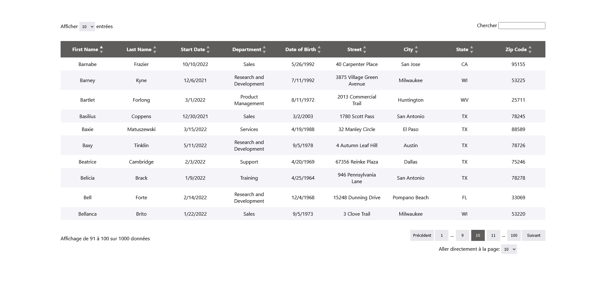
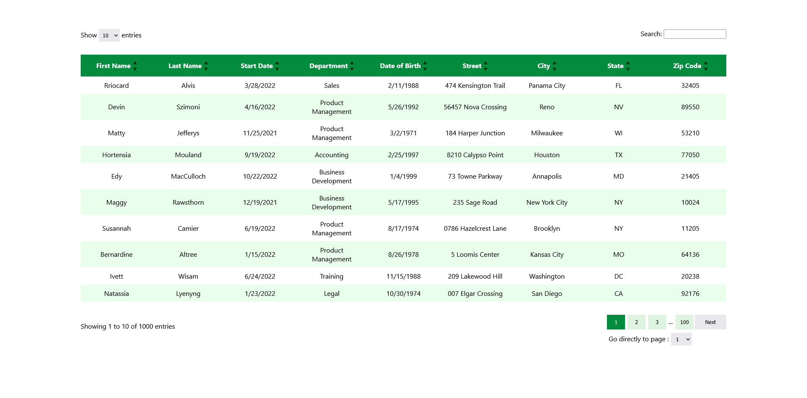

# Datable with ReactJS

Datable is a ReactJS library to create a custom and sortable data table. This is the V1 of this project. 



## Features

   - Searching a direct data
   - Paginate and Sort data
   - Customizable
   - Add table headers
   - Responsive


## Installation

```bash
npm install datable
```

## Usage

### General
```reactJS
import datable from 'datable';
import Header from 'datable';
import Table from 'datable';
import Footer from 'datable';


//to use all the table - Header, table, footer 
<DataTable />

//to use the header
<Header />

//to use only the table
<Table />

//to use the footer
<Footer />
```

### include data

```
// titles of columns:
const labels = [ 
      { text: "column title 1", value: "valueTitle1" },
      { text: "column title 2", value: "valueTitle2" },
      { text: "column title 3", value: "valueTitle3" },
      {...},
]

// data in rows:
const data = [ 
      { valueTitle1: "data 1",
        valueTitle2: "data 2",
        valueTitle3: "data 3",
       }
]

// example
const labels = [
    { text: "First Name", value: "firstName" },
    { text: "Last Name", value: "lastName" },
    { text: "Start Date", value: "startDate" },
    { text: "Department", value: "department" },
  ];
  
  const data = [
    {
      firstName: "Tyson",
      lastName: "Doe",
      startDate: "04/14/2021",
      department: "Marketing",
    },
    {
      firstName: "Anna",
      lastName: "Alia",
      startDate: "03/02/2020",
      department: "Marketing",
    },
]

```
### Custom 


| Property         | Type    | Required | Default                 | Description                                           |
| :--------------- | :------ | :------- | :---------------------- | :---------------------------------------------------- |
| labels           | array   | true     | []                      | Names of columns                                      |
| data             | array   | true     | []                      | Data in rows                                          |
| language         | boolean | false    | false                   | false = french, true = english                        |
| firstBackground  | string  | false    | '#5e5d5c'               | Background color of columns and active page           |
| secondBackground | string  | false    | '#e9e9ed'               | Background color of certains rows and page not active |
| color            | string  | false    | 'white'                 | Column font color                                     |
| arrowColor       | string  | false    | '#75797a'               | Arrow's color to sort data                            |
| customButton     | object  | false    | []                      | to customize the previous and next button             |
| customColumn     | object  | false    | backgroundColor, color  | to customize the column component                     |
| customFooter     | object  | false    | []                      | to customize the footer component                     |
| customHeader     | object  | false    | []                      | to customize the header component                     |
| customPagination | object  | false    | []                      | to customize the pagination                           |
| customRow        | object  | false    | backgroundColor, filter | to customize the row component                        |
| customSearch     | object  | false    | []                      | to customize the search section                       |
| customArrow      | object  | false    | []                      | to customize arrows to sort data                      |
| customLength     | object  | false    | []                      | to customize the section of "show length entries"     |

#### Exemple custom

```
<DataTable 
labels={labels} 
data={data} 
language={true}
firstBackground={"#038C3E"}
secondBackground={"#DEF4E0"}
arrowColor={"#022601"}
/>
```



## License

[MIT](https://choosealicense.com/licenses/mit/)